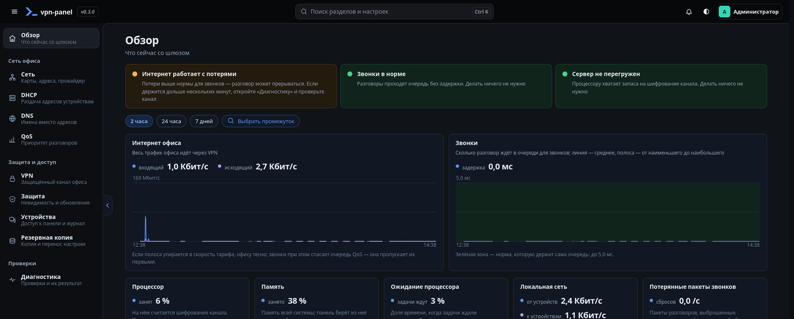
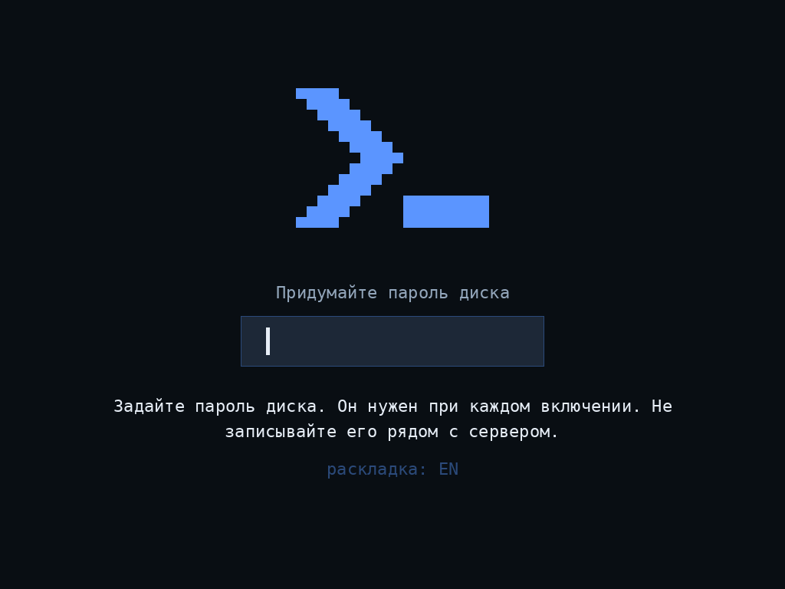

# VPN Panel

Локальная веб-панель управления офисным VPN-шлюзом на Ubuntu 26.04. Настройка
сети (WAN/LAN), выдачи адресов (DHCP), разрешения имён (DNS), VPN-туннелей и
приоритета трафика для IP-телефонии — в браузере, без командной строки. Панель
работает в изолированной сети и не обращается к внешним ресурсам.

Свободная, с открытым исходным кодом. Лицензия Apache-2.0.

## Установка


**Главное условие — до любой команды.** Панель ставится на **отдельный
компьютер, который станет шлюзом офиса**: Ubuntu 26.04 LTS (64-разрядная),
две сетевые карты — одна к провайдеру (WAN), одна в офис (LAN), интернет на
время установки. Не ставьте панель на рабочий компьютер или ноутбук: она
управляет сетью машины, на которой стоит.

```bash
wget -qO- https://vpn-vendor.github.io/vpn-panel/install.sh | sudo bash
```

Команда одна для любой Ubuntu 26.04 — с рабочим столом и без него. Она
подключает источник обновлений проекта, ставит ключ проверки подписи и
пакет `vpn-panel`. Сеть, файрвол и службы до вашей команды в панели не
меняются.

**Сначала один вопрос: есть ли на сервере интернет?**

| Ситуация | Что делать |
|---|---|
| Интернет на сервере есть | способ 1 (рабочий стол, двойной щелчок) или способ 2 (одна команда, любая Ubuntu) |
| Интернета нет, Ubuntu ещё не стоит — или на сервере нет экрана | способ 3: флешка, загрузка с неё — ни интернета, ни команд; диск шифруется |
| Интернета нет, Ubuntu Server уже стоит | способ 4: та же флешка и одна строка из комплекта |

| Способ | Кому подходит | Диск шифруется |
|---|---|---|
| [Файл `.deb`](#способ-1-файл-deb) | Ubuntu с рабочим столом: скачать и открыть двойным щелчком | нет |
| [Одна команда](#способ-2-одна-команда) | любая Ubuntu 26.04, в том числе Server без рабочего стола | нет |
| [Носитель панели](#способ-3-носитель-панели--без-интернета-диск-шифруется) | чистая установка с флешки без интернета, диск стирается | да |
| [Флешка на уже стоящую Ubuntu](#способ-4-та-же-флешка-на-уже-стоящую-ubuntu-без-интернета) | Ubuntu Server без интернета: одна строка, пакеты с флешки | нет |

Обновления во всех случаях приходят сами из источника проекта и
проверяются подписью, как только у шлюза есть интернет.

### Способ 1: файл `.deb`

1. Откройте раздел [Releases](https://github.com/vpn-vendor/vpn-panel/releases)
   и скачайте файл `vpn-panel_<версия>_amd64.deb`.
2. Откройте скачанный файл двойным щелчком. Запустится «Центр приложений» —
   нажмите «Установить» и введите пароль своей учётной записи.
3. В списке приложений появится значок «VPN Panel» — он открывает панель.

Если двойной щелчок ничего не открыл, поставьте тот же файл из терминала,
находясь в папке с ним. Первая половина команды обновляет списки пакетов:
на только что установленной системе без этого не найдутся зависимости.

```bash
sudo apt update && sudo apt install ./vpn-panel_*_amd64.deb
```

### Способ 2: одна команда

```bash
wget -qO- https://vpn-vendor.github.io/vpn-panel/install.sh | sudo bash
```

Сценарий сначала печатает, что именно сделает, и ставит пакет штатным
менеджером Ubuntu. На другой системе или архитектуре он откажется и объяснит
почему.

### После установки: первый вход

На шлюзе с рабочим столом откройте значок «VPN Panel». На сервере без
рабочего стола выполните:

```bash
sudo vpn-panel-code
```

Команда напечатает код входа и адрес, по которому панель открыта из офисной
сети. Откройте этот адрес в браузере любого компьютера офиса и введите код.
После настройки сети панель доступна по адресу `http://vpn.lan/`.

Сети в офисе ещё нет? Соедините ноутбук с сервером одним кабелем: карта
сервера сама возьмёт адрес вида `169.254.…`, команда напечатает его через
минуту, а ноутбук на Windows или macOS возьмёт себе такой же адрес сам.



### Управление с консоли

Шлюзом можно управлять и без браузера — с клавиатуры самого сервера или по
SSH:

```bash
sudo vpn-panel
```

Откроется меню: состояние шлюза, код входа, перезапуск панели, сведения для
поддержки, копия настроек, выход на всех устройствах и помощь — что делать,
если нет интернета, не открывается панель или забыт пароль диска. Выбор —
цифрой, вопросы «да или нет» — буквами `y` и `n`. Это страховка на случай,
когда панель в браузере не открывается: меню работает и тогда. Те же действия
доступны командами — их перечислит `vpn-panel help`.

### Способ 3: носитель панели — без интернета, диск шифруется

Установка с нуля: **единственный внутренний диск стирается целиком и
шифруется**, панель и всё нужное ей ставятся без интернета и без единой
команды. Это путь для сервера, у которого нет интернета или нет экрана, и
для шлюза, который должен быть защищён от кражи: с двумя первыми способами
диск остаётся таким, каким его поставили вы. Переустановить свежий сервер —
нормально: терять на нём нечего, занимает четверть часа.

Что нужно: компьютер с одним внутренним диском и верной датой в настройках
BIOS/UEFI (с часами, отставшими на годы, образ Ubuntu зависает при
загрузке), официальный образ Ubuntu Desktop 26.04 LTS с сайта Ubuntu и архив
`vpn-panel-media-<версия>.zip` из раздела **Releases**.

1. Запишите образ Ubuntu на флешку программой, которая оставляет флешку
   доступной для записи (например, Rufus в режиме «ISO-образ»), и скопируйте
   в корень флешки содержимое архива **с заменой файлов**: `autoinstall.yaml`,
   папки `vpn-panel` и `boot` — рядом с папкой `casper`. Меню и экран
   установщика будут по-русски.
   Если программа записи пишет образ побайтно (Etcher, dd), возьмите вторую
   флешку: отформатируйте её в FAT32 с меткой тома `CIDATA` и скопируйте
   содержимое архива в её корень; при установке вставьте обе (меню и окно
   подтверждения в этом случае английские: «Try or Install Ubuntu», затем
   «Install»).
2. Загрузитесь с флешки: вставьте её, включите компьютер и сразу
   нажимайте клавишу меню загрузки — чаще всего `F12`, `F11`, `F8` или
   `Esc` (она написана внизу первого экрана при включении), в меню
   выберите флешку. Затем выберите «Установить шлюз VPN Panel — стирает
   весь диск» (если экран остаётся чёрным или мигает — второй пункт, та же
   установка без драйвера видеокарты). В окне «Всё готово к установке»
   нажмите «Установить». Дальше установщик всё делает сам и
   перезагружает компьютер.

   

3. При первом включении сервер попросит придумать пароль диска: латинские
   буквы, цифры и знаки, от 12 символов, дважды. Восстановить его нельзя:
   забытый пароль — переустановка и восстановление настроек из резервной
   копии панели.

   

4. Пароль спрашивается при каждом включении — на экране и клавиатуре самого
   сервера.

   

5. Затем Ubuntu предложит создать учётную запись компьютера. После входа
   панель открывается значком «VPN Panel» на рабочем столе шлюза, а из
   офисной сети — по адресу `http://vpn.lan/`.

Один образ можно собрать самому:
`installer/build-media.sh --deb <пакет.deb> --out <каталог> --iso <официальный ISO> --iso-out <образ.iso>`
(с ключом `--unattended` подтверждение стирания не спрашивается — для
массовой установки одинаковых шлюзов). Подробности — в файле
`ПРОЧТИ-МЕНЯ.txt` внутри архива.

### Способ 4: та же флешка на уже стоящую Ubuntu без интернета

Ubuntu Server уже стоит, переустанавливать её не хочется, а интернета на
сервере нет. Подготовьте флешку как в способе 3, вставьте в сервер **только
её** (ту, где лежит папка `vpn-panel`) и наберите на его клавиатуре одну
строку:

```bash
sudo mount -r /dev/disk/by-id/usb-*part1 /mnt && sudo sh /mnt/vpn-panel/install.sh
```

Сценарий с флешки сначала печатает, что сделает, ставит панель и её
зависимости штатным менеджером Ubuntu только из пакетов на флешке и ничего
после себя не оставляет; сеть, файрвол и службы не трогает. Диск при этом
не стирается и не шифруется. Если строка ответила «does not exist» — сервер
не видит флешку: вставьте её заново или в другой разъём. Дальше — как после
любой установки: `sudo vpn-panel-code` печатает адрес и код входа.

## Возможности

- Роли сетевых карт: WAN (интернет провайдера) и LAN (офис); поддержка нескольких провайдеров.
- DHCP и DNS для офисной сети, локальный домен `vpn.lan`.
- VPN-туннели (WireGuard, OpenVPN) с импортом готовых файлов подключения.
- Приоритет голосового трафика (QoS): звонки не страдают от нагрузки канала.
- Диагностика офисной сети и качества канала.

## Требования

- Ubuntu 26.04 LTS на физическом ПК-шлюзе.
- Две сетевые карты: одна к провайдеру (WAN), одна в офис (LAN).

## Первые часы в офисе

Первый выпуск — ранний. Поставьте шлюз так, чтобы вернуться назад можно было
за минуту:

1. **Прежний роутер не убирайте.** Он остаётся рядом, включённый и с прежними
   настройками. Если офис останется без связи — переставьте кабель провайдера
   и кабель офисной сети обратно в него, и всё заработает как раньше.
2. **Ставьте в нерабочее время** и проверьте до прихода людей: интернет с
   компьютера офиса, звонок наружу и звонок снаружи, разговор не короче
   минуты в обе стороны.
3. **Сделайте копию настроек** сразу после настройки — страница «Резервная
   копия». Копию храните вне шлюза: забытый пароль диска лечится только
   переустановкой и восстановлением из копии.
4. **Перезагрузите шлюз один раз при себе** и убедитесь, что после ввода
   пароля диска офис сам возвращается в сеть.
5. **Первые сутки смотрите на «Обзор».** Панель сама напомнит о страховке и
   скажет, если что-то случилось без вас: откат настроек, обрыв питания,
   закрытый офис.
6. **Если что-то не так** — верните прежний роутер и опишите случившееся в
   разделе задач проекта. Об уязвимостях — см. файл `SECURITY.md`.

Панель устроена так, чтобы при сбое остаться на прежних настройках или
закрыть офис от интернета, но не выпустить его мимо канала. Офис без связи
при неполадке — ожидаемое поведение, а не поломка: для него и нужен прежний
роутер рядом.

## Что проверено и что нет

Проверено в лаборатории автора, на виртуальных машинах:

- установка с носителя на UEFI и BIOS, шифрование диска, смена пароля диска,
  обрыв питания во время этих шагов;
- подключение к провайдеру по DHCP, PPPoE и через VLAN, перезагрузки во всех
  этих сочетаниях;
- канал WireGuard и OpenVPN: пока канала нет, трафик офиса наружу не идёт —
  захват на карте провайдера показывает ноль пакетов мимо канала;
- обрыв питания во время изменения сети и во время загрузки настроек из
  файла: шлюз возвращается к настройкам «до» или «после», без половины;
- копия настроек: выгрузка, полная переустановка, восстановление на том же и
  на другом железе;
- работа панели в Firefox и Edge.

Не проверено — это покажет только настоящий офис:

- настоящее железо: сетевые карты, диски и то, как настоящий диск переживает
  обрыв питания;
- настоящие провайдеры и их особенности;
- качество звонков на настоящем канале с потерями и задержками;
- обновление с предыдущей версии: первой версии обновляться не с чего.

> Первая сборка — ранняя. Ставьте её там, где рядом есть прежний роутер и
> человек, который может переставить кабель.

## Лицензия

Apache-2.0 — см. файлы `LICENSE` и `NOTICE`.
